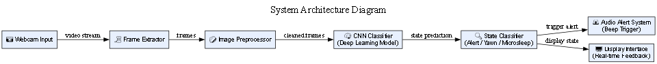
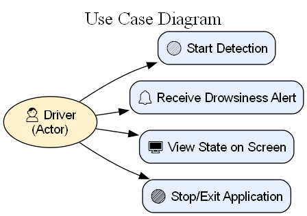
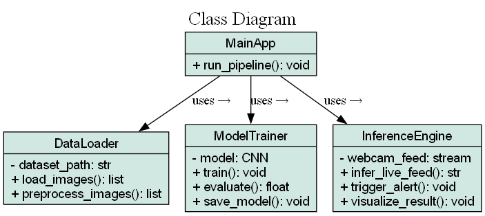

# 💤 Drowsy Driver Detection 🚗💥

[](LICENSE)


> ⚠️ Real-time AI-powered driver monitoring system to classify alertness states: **Alert**, **Microsleep**, and **Yawning**.

---

## 🚀 Project Overview

The **Drowsy Driver Detection System** uses **Deep Learning**, **Computer Vision**, and **CNNs** to monitor a driver's facial state via webcam. It ensures enhanced road safety by detecting signs of fatigue and alerting drivers in real-time.

🔍 **Key Features:**
- Real-time video analysis via webcam
- Classifies driver states (Alert / Microsleep / Yawning)
- Alerts user with beep sound on drowsiness
- Trainable and customizable model
- Includes diagrams, screenshots, and a visual demo

---

## 🎥 Live Demo


---

## 📊 Diagrams

### 🧠 Enhanced System Architecture


### 📘 Use Case Diagram


### 📦 Class Diagram


---

## 🖼️ Sample Output Screenshots

| Training Phase | Evaluation Phase | Inference |
|----------------|------------------|-----------|
|  |  |  |
|  |  |   |
|  |   |   |

---

## 📂 Project Structure

```
DrowsyDriverDetection/
│
├── assets/
│   ├── diagrams/
│   └── output screenshots/
│
├── dataset/
├── models/
├── scripts/
├── utils/
│
├── data_loader.py
├── refactored_drowsy_detection.py
├── main.py
├── requirements.txt
└── README.md
```

---

## 🧠 Dataset

- **Source**: [Kaggle - Frame Level Driver Drowsiness Detection (FL3D)](https://www.kaggle.com/datasets/matjazmuc/frame-level-driver-drowsiness-detection-fl3d)
- **Size**: 53,331 labeled images
- **Labels**:
  - 🟢 Alert
  - 🟡 Microsleep
  - 🔴 Yawning

---

## 🎯 Objectives

- ✅ Detect signs of drowsiness in real-time
- ✅ Raise awareness and prevent accidents
- ✅ Support webcam and live deployment
- ✅ Optimize performance using GPU (if available)

---

## ⚙️ Setup & Installation Guide

### 1️⃣ Prerequisites

- Python 3.10 (64-bit)
- [Anaconda](https://www.anaconda.com/)
- Git

### 2️⃣ Clone Repository

```bash
git clone https://github.com/IsaacZachary/DrowsyDriverDetection.git
cd DrowsyDriverDetection
```

### 3️⃣ Setup Virtual Environment (VS Code or Terminal)

```bash
conda create --name drowsy_detection python=3.10
conda activate drowsy_detection
pip install -r requirements.txt
```

---

## 🚦 Running the Model

### 🏋️‍♂️ Training

```bash
python refactored_drowsy_detection.py --train
```

### 🧪 Evaluation

```bash
python refactored_drowsy_detection.py --evaluate
```

### 📸 Real-Time Inference (Webcam)

```bash
python refactored_drowsy_detection.py --infer
```

---

## 📓 Jupyter Notebook Usage

If using notebooks (e.g., `Google Colab`, `VS Code` Jupyter):

```python
!python refactored_drowsy_detection.py --train
!python refactored_drowsy_detection.py --evaluate
!python refactored_drowsy_detection.py --infer
```

---

## 💻 How to Use in VS Code

1. Open the folder using `File > Open Folder`
2. Open integrated terminal (`Ctrl + ~`)
3. Activate your environment:
   ```bash
   conda activate drowsy_detection
   ```
4. Run desired Python script (`refactored_drowsy_detection.py`) using run button or terminal.

---

## 🧠 Model Details

- Model: Custom **CNN**
- Libraries: `TensorFlow`, `OpenCV`, `NumPy`, `Pandas`, `Matplotlib`
- GPU support: ✅
- Alerts: Audio beeps on detection

---

## 🤝 Contributing

Contributions, ideas, and suggestions are warmly welcome! 🚀

```bash
1. Fork the repository
2. Create your branch: `git checkout -b feature-name`
3. Commit changes: `git commit -m 'Add some feature'`
4. Push: `git push origin feature-name`
5. Submit a pull request
```

---

## 🛡️ License

This project is licensed under the MIT License.

---

## 👤 Author

- **Isaac Zachary**
- 📨 Email: [isaaczachary18@gmail.com](mailto:isaaczachary18@gmail.com)
- 🧑‍💻 GitHub: [IsaacZachary](https://github.com/IsaacZachary)
- 🌐 Portfolio: [Portfolio](https://isaaczachary.github.io/portfolio/)

---

## 🌟 Show Your Support

If you find this helpful, kindly give it a ⭐ and share with others!

---

> “Technology is best when it brings people together.” — Matt Mullenweg
```
